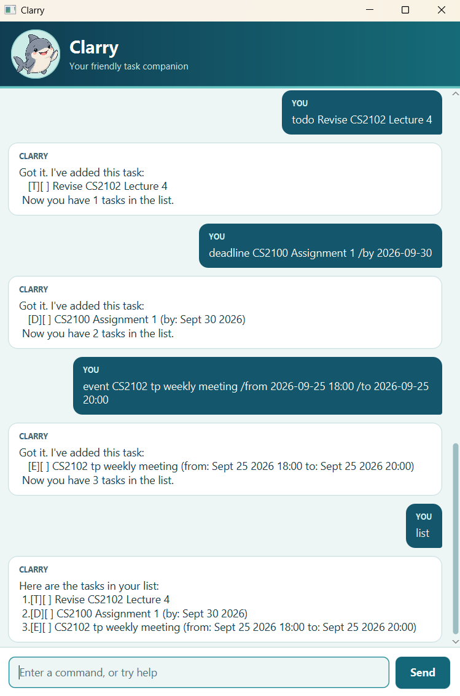

# Clarry User Guide

**Your little task shark.** Clarry helps you keep todos, deadlines, and events in one place. Type a command, and Clarry will help you keep your tasks on your radar.



*The screenshot shows an earlier version of Clarry's wording. This guide describes the current source version; older downloads may not include every command or validation below.*

## Quick start

1. Install **Java 25**. Run `java -version` in a terminal to check your version.
2. Download `clarry.jar` from [Clarry's releases](https://github.com/Chrsxndr/ip/releases) and place it in a folder you can write to.
3. Open a terminal **in that folder** and run:

   ```text
   java -jar clarry.jar
   ```

4. Type `help` in the input box, then press **Enter** or click **Send**.
5. Try `todo read book`, followed by `list`.

To run the current version from the [source project](https://github.com/Chrsxndr/ip), use `./gradlew run` on macOS/Linux or `.\gradlew.bat run` on Windows from the project folder, with Java 25 installed.

## Before you type

- Commands are **lowercase**. Replace uppercase placeholders such as `DESCRIPTION` with your own text; do not type the placeholder itself.
- Extra spaces and tabs are accepted. Descriptions may contain spaces, punctuation, and Chinese or other Unicode text, but not `|` or control characters.
- Dates use `YYYY-MM-DD`, for example `2026-09-30`. Event times use the **24-hour clock**: `YYYY-MM-DD HH:mm`.
- Use each date marker (`/by`, `/from`, `/to`) once, in the order shown below.
- Exact duplicates with the same task type, case-sensitive description, and schedule are rejected, even if the existing task is complete.

## Add tasks

### Todo: `todo DESCRIPTION`

Use a todo for a task without a date.

```text
todo read book
```

Clarry adds the task and tells you how many tasks are aboard.

### Deadline: `deadline DESCRIPTION /by DATE`

Use a deadline for something due on a particular day.

```text
deadline submit assignment /by 2026-09-30
```

This adds a task due on 30 September 2026.

### Event: `event DESCRIPTION /from START /to END`

Use an event for an activity with a start and end time.

```text
event project meeting /from 2026-09-25 18:00 /to 2026-09-25 20:00
```

Events can span multiple days. The end must be **later than** the start; equal times and impossible dates are rejected.

## View and find tasks

| Command | What it does | Example |
| --- | --- | --- |
| `list` | Shows every task in its current order. | `list` |
| `find KEYWORD` | Finds descriptions containing your text, ignoring letter case. | `find BOOK` |
| `on DATE` | Shows deadlines due that day and events covering that day. | `on 2026-09-25` |
| `help` | Shows all commands and their formats. | `help` |

`find book` matches both "read book" and "return BOOK". Multiple words are treated as one phrase, so `find read book` looks for that phrase. An empty result changes nothing.

`on` includes both the start and end dates of a multi-day event. Undated todos do not appear in date results.

For example, a list entry might look like:

```text
1.[T][X] read book
```

`T` means todo, `D` deadline, and `E` event. `[X]` means complete; `[ ]` means incomplete.

## Complete or remove tasks

**Run `list` first and use the number from that full list.** Numbers in `find` or `on` results are separate display numbers and must not be used to identify tasks for these commands.

| Command | What it does | Example |
| --- | --- | --- |
| `mark NUMBER` | Marks a task complete. | `mark 1` |
| `unmark NUMBER` | Makes a task incomplete again. | `unmark 1` |
| `delete NUMBER` | Permanently removes a task. There is no undo command. | `delete 1` |

Numbers start at 1 and must contain digits only. After deleting a task, run `list` again because the remaining tasks are renumbered.

## Finish a session

Enter `bye`. In the GUI, Clarry says goodbye and disables the input; close the window when finished. In the console version, `bye` ends the program.

## Saving and recovering tasks

Changes save automatically to `data/clarry.txt`, relative to the folder from which you launched Clarry. Always launch from the same folder to use the same task list. A missing save file starts a fresh list.

To back up your tasks, close Clarry and copy `data/clarry.txt` somewhere safe. **Use only one Clarry window for a task file at a time**: two instances can overwrite each other's changes.

| Problem | What to do |
| --- | --- |
| A command produces an ERROR card | Read the explanation, correct the command, and submit it again. Use `help` if unsure. |
| A task number does not exist | Run `list` and use a current number. |
| A task is already aboard | Use `list` to find the existing task. Different dates or times count as different tasks. |
| Saving fails | The task change is not applied. Check folder access and free disk space, then retry. |
| Saved data is unreadable or damaged | Clarry reports the problem with your first command response and blocks changes. Back up the file, restore a valid backup or repair the file/access permissions, then restart Clarry. |
| Your task list unexpectedly appears empty | Check that you launched from the usual folder and that its `data/clarry.txt` is present. |
| The window is crowded | Resize it and scroll through long replies. The input bar stays at the bottom. |

If only some saved records are invalid, Clarry shows the readable tasks while keeping the original file protected.
